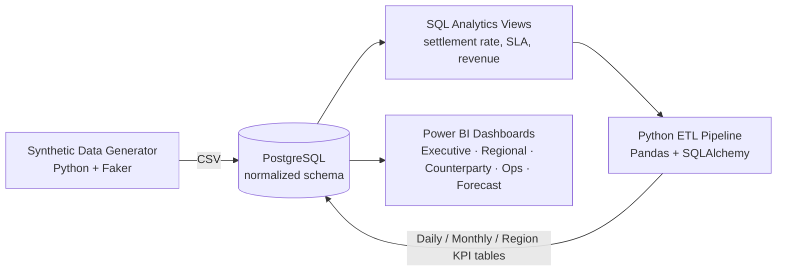
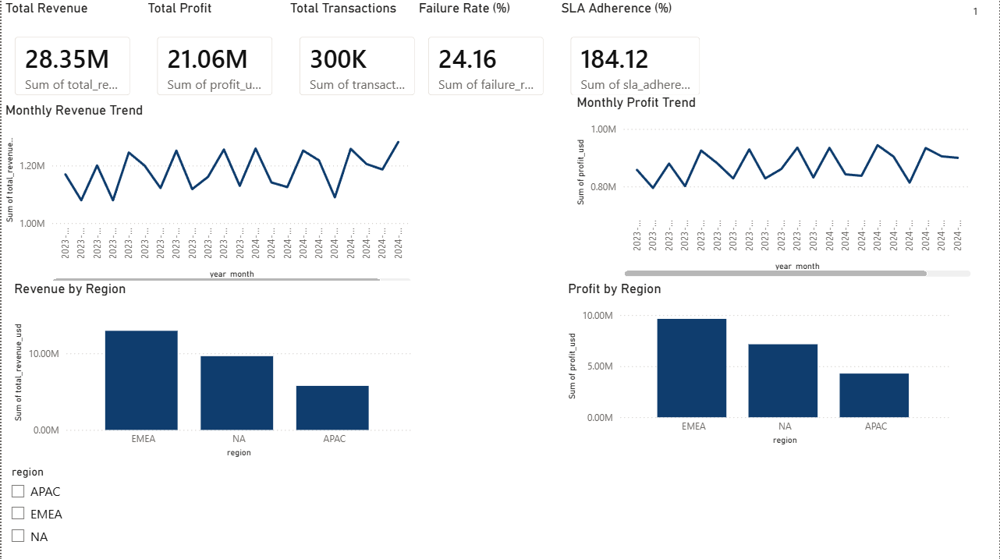
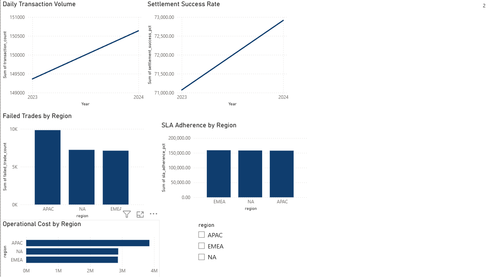
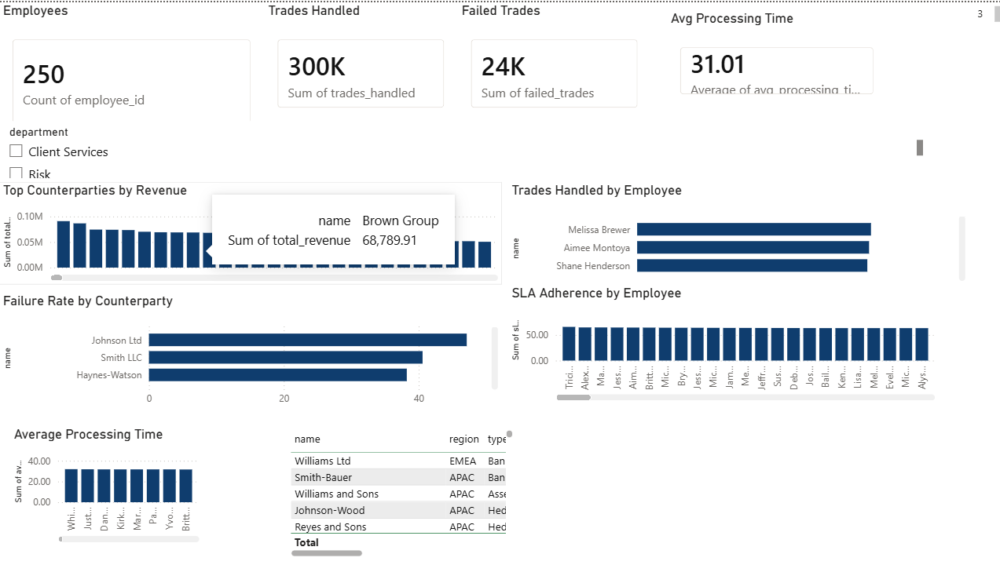

# 📊 Financial Operations KPI Dashboard

An end-to-end financial analytics platform that simulates investment bank
back-office operations — synthetic trade data, a normalized PostgreSQL
warehouse, a Python ETL pipeline, and interactive Power BI dashboards covering
settlement performance, revenue, risk, and operational SLAs.

[](https://mattperrymatt45-pixel-financial-operatio-ai-assistantapp-hjzhgg.streamlit.app/)


**🔗 [Try the live AI Assistant](https://mattperrymatt45-pixel-financial-operatio-ai-assistantapp-hjzhgg.streamlit.app/)** — ask financial-ops questions in plain English and get live SQL-backed answers.

---

## Overview

This project models the full lifecycle of trade processing at an investment
bank — trade capture, settlement, exceptions, and profitability — across
three regions (APAC, EMEA, NA) and five asset classes. It's built as a
portfolio-grade data pipeline: synthetic data with realistic, correlated
business rules → relational storage → SQL analytics → automated KPI
computation → BI-ready dashboards.

### Architecture



---

## Features

- **300,000+ synthetic transactions** generated with realistic correlations:
  large trades take longer to process, new/high-risk counterparties fail
  settlement more often, failures spike around holidays, and failed trades
  cost more to resolve.
- **Normalized PostgreSQL schema** (Calendar, Employees, Counterparties,
  Transactions) with foreign keys and indexes tuned for the analytics layer.
- **8 SQL analytics views** covering daily volume, settlement success rate,
  failure breakdowns, revenue trends, top counterparties, SLA adherence,
  operational cost, and employee productivity.
- **Automated ETL pipeline** that dedupes, standardizes currency to USD, and
  computes Profit / Settlement Delay / Failure Rate into three KPI tables.
- **5 Power BI dashboards** — Executive, Regional, Counterparty, Operations,
  and Forecast — with drill-downs, cross-filtering, and time-series
  forecasting.
- **Streamlit AI assistant** — ask questions in plain English ("Which
  counterparty caused the most failures?"), get LLM-generated SQL, live
  query results, and a natural-language business summary — locked to a
  read-only database role so it can never write or delete data.
- **Automated pipeline** — one script re-runs the ETL, triggers a Power BI
  dataset refresh, and generates an AI summary of the latest KPIs,
  schedulable via Windows Task Scheduler, cron, or Airflow. *(Scheduled
  email delivery of the report is planned but not yet implemented — see
  Roadmap.)*

---

## Tech Stack

| Layer | Tools |
|---|---|
| Data generation | Python, Pandas, NumPy, Faker |
| Database | PostgreSQL |
| ETL | Python, SQLAlchemy, psycopg2 |
| Analytics | SQL views |
| Visualization | Power BI (DAX, forecasting) |
| AI Assistant | Streamlit, OpenAI API |
| Automation | Python, Windows Task Scheduler / cron / Airflow, SMTP |

---

## Dashboards

### Executive Overview
KPI scorecards (Revenue, Profit, Transactions, Failure Rate, SLA Adherence), monthly revenue/profit trends, and revenue/profit split by region.



### Regional Operations
Daily transaction volume and settlement success trends, failed trades by region, SLA adherence by region, and operational cost by region.



### Counterparty & Employee Performance
Top counterparties by revenue, failure rate by counterparty, employee productivity (trades handled, SLA adherence, average processing time).



> **Note:** a couple of visuals above (SLA Adherence by Region, Settlement Success Rate trend) are currently
> summing a pre-aggregated percentage column across many rows instead of using a volume-weighted average,
> which inflates the numbers. See `dashboard/PowerBI_Build_Guide.md` Section 3 for the correct DAX measures
> (`SLA Adherence %`, `Settlement Success %`) — swap the field wells from the raw column to these measures
> to fix it.

---

## Project Structure

```text
financial-operations-dashboard/
├── data/               # Phase 1: synthetic data generator + CSVs
├── database/           # Phase 2: PostgreSQL schema + load script
├── analytics/          # Phase 3: SQL analytics views
├── etl/                # Phase 4: Python ETL pipeline
├── dashboard/           # Phase 5: Power BI build guide, .pbix, screenshots
├── common/              # shared DB + LLM helpers (used by ai_assistant & automation)
├── ai_assistant/        # Phase 6: Streamlit AI assistant
├── automation/          # Phase 7: pipeline orchestration + scheduling docs
├── reports/             # pipeline logs land here
├── requirements.txt
├── .env.example
├── SETUP.md            # full local setup + run instructions
└── README.md            # you are here
```

---

## Quick Start

```bash
git clone https://github.com/mattperrymatt45-pixel/financial-operations-dashboard.git
cd financial-operations-dashboard
python -m venv venv && venv\Scripts\activate     # Windows
pip install -r requirements.txt

python data/generate_data.py
python database/load_data.py
psql -U postgres -d financial_ops -f analytics/views.sql
python etl/etl_pipeline.py
```

Then open `dashboard/*.pbix` in Power BI Desktop.

Launch the AI assistant (needs `OPENAI_API_KEY` in `.env` first):
```bash
psql -U postgres -d financial_ops -f ai_assistant/setup_readonly_role.sql
streamlit run ai_assistant/app.py
```

Full walkthrough, including PostgreSQL setup on Windows/macOS/Linux, is in
[SETUP.md](SETUP.md).

---

## Business Rules Modeled

- Large trades → longer processing time
- New counterparties (< 90 days onboarded) → higher settlement failure rate
- Settlement near a holiday → increased failure probability
- Failed trades → higher operational cost, reduced booked revenue
- SLA breach if processing time exceeds 30 minutes
- APAC carries the highest transaction volume, concentrated in APAC market hours

---

## Roadmap

- [x] Phase 1 — Synthetic data generation
- [x] Phase 2 — PostgreSQL database
- [x] Phase 3 — SQL analytics views
- [x] Phase 4 — Python ETL pipeline
- [x] Phase 5 — Power BI dashboards
- [x] Phase 6 — Streamlit AI assistant (natural-language querying via LLM)
- [x] Phase 7 — End-to-end pipeline automation (ETL → Power BI refresh → AI summary)
- [ ] Phase 8 — Scheduled email reporting

---

## License

MIT — free to use, modify, and build on.
