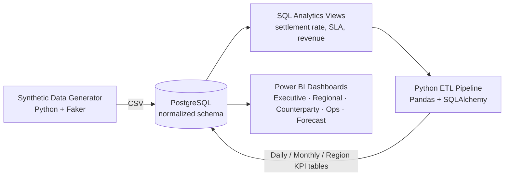

# 📊 Financial Operations KPI Dashboard

An end-to-end financial analytics platform that simulates investment bank
back-office operations — synthetic trade data, a normalized PostgreSQL
warehouse, a Python ETL pipeline, and interactive Power BI dashboards covering
settlement performance, revenue, risk, and operational SLAs.


---

## Overview

This project models the full lifecycle of trade processing at an investment
bank — trade capture, settlement, exceptions, and profitability — across
three regions (APAC, EMEA, NA) and five asset classes. It's built as a
portfolio-grade data pipeline: synthetic data with realistic, correlated
business rules → relational storage → SQL analytics → automated KPI
computation → BI-ready dashboards.

### Architecture



---

## Features

- **300,000+ synthetic transactions** generated with realistic correlations:
  large trades take longer to process, new/high-risk counterparties fail
  settlement more often, failures spike around holidays, and failed trades
  cost more to resolve.
- **Normalized PostgreSQL schema** (Calendar, Employees, Counterparties,
  Transactions) with foreign keys and indexes tuned for the analytics layer.
- **8 SQL analytics views** covering daily volume, settlement success rate,
  failure breakdowns, revenue trends, top counterparties, SLA adherence,
  operational cost, and employee productivity.
- **Automated ETL pipeline** that dedupes, standardizes currency to USD, and
  computes Profit / Settlement Delay / Failure Rate into three KPI tables.
- **5 Power BI dashboards** — Executive, Regional, Counterparty, Operations,
  and Forecast — with drill-downs, cross-filtering, and time-series
  forecasting.

---

## Tech Stack

| Layer | Tools |
|---|---|
| Data generation | Python, Pandas, NumPy, Faker |
| Database | PostgreSQL |
| ETL | Python, SQLAlchemy, psycopg2 |
| Analytics | SQL views |
| Visualization | Power BI (DAX, forecasting) |
| *(planned)* AI Assistant | Streamlit, OpenAI/Gemini API |
| *(planned)* Automation | Cron / Task Scheduler / Airflow |

---

## Dashboards

> Screenshots go here — export each Power BI page as an image
> (`File → Export → Export to Image` or a screenshot) and drop them into a
> `dashboard/screenshots/` folder, then reference them like:
> ``
> ``
> ``

| Dashboard | Key Metrics |
|---|---|
| Executive | Total Transactions, Revenue, Settlement Success %, SLA % |
| Regional | Revenue by Region, Volume Trends, Failure Rate |
| Counterparty | Revenue Contribution, Failure Rate, Risk Profile |
| Operations | Employee Productivity, Exception Types, Op Cost |
| Forecast | Revenue, Volume, and Failure Rate projections |

---

## Project Structure

```text
financial-operations-dashboard/
├── data/               # Phase 1: synthetic data generator + CSVs
├── database/           # Phase 2: PostgreSQL schema + load script
├── analytics/          # Phase 3: SQL analytics views
├── etl/                # Phase 4: Python ETL pipeline
├── dashboard/           # Phase 5: Power BI build guide + .pbix file
├── requirements.txt
├── SETUP.md            # full local setup + run instructions
└── README.md            # you are here
```

---

## Quick Start

```bash
git clone https://github.com/<your-username>/financial-operations-dashboard.git
cd financial-operations-dashboard
python -m venv venv && venv\Scripts\activate     # Windows
pip install -r requirements.txt

python data/generate_data.py
python database/load_data.py
psql -U postgres -d financial_ops -f analytics/views.sql
python etl/etl_pipeline.py
```

Then open `dashboard/*.pbix` in Power BI Desktop.

Full walkthrough, including PostgreSQL setup on Windows/macOS/Linux, is in
[SETUP.md](SETUP.md).

---

## Business Rules Modeled

- Large trades → longer processing time
- New counterparties (< 90 days onboarded) → higher settlement failure rate
- Settlement near a holiday → increased failure probability
- Failed trades → higher operational cost, reduced booked revenue
- SLA breach if processing time exceeds 30 minutes
- APAC carries the highest transaction volume, concentrated in APAC market hours

---

## Roadmap

- [x] Phase 1 — Synthetic data generation
- [x] Phase 2 — PostgreSQL database
- [x] Phase 3 — SQL analytics views
- [x] Phase 4 — Python ETL pipeline
- [x] Phase 5 — Power BI dashboards
- [ ] Phase 6 — Streamlit AI assistant (natural-language querying via LLM)
- [ ] Phase 7 — End-to-end automation + scheduled email reporting

---

## License

MIT — free to use, modify, and build on.
